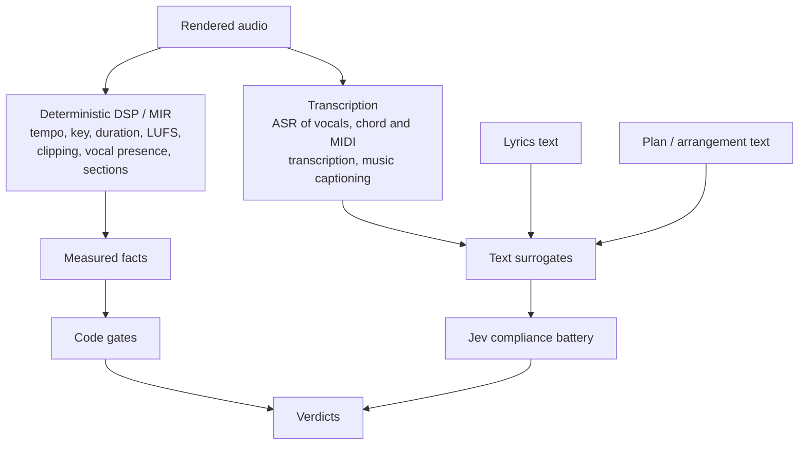
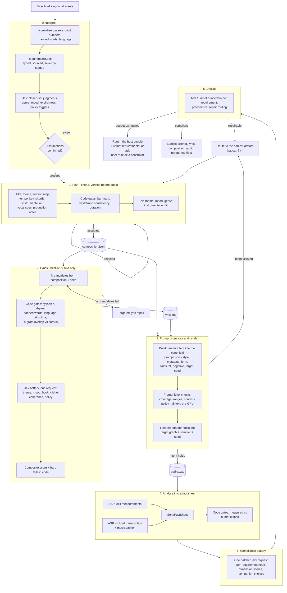

# Music Master — a requirement-compliant lyrics + composition generator

Status: design. Nothing here is implemented yet; `spikes/measurement_probe.py` is a
feasibility probe for the measurement layer, not the system.

## 1. What this system is

Music Master takes a brief in natural language and returns a song — lyrics and a
composed, rendered track — together with a machine-checkable **compliance report** that
states, per requirement, whether the output meets it, on what evidence, and with what
confidence.

The brief may specify, in any mixture:

- content: theme, narrative, subject matter, language, required or forbidden words
- form: duration, tempo, key, meter, section order, number of verses, hook placement
- style: genre, era, production aesthetic, instrumentation, vocal type and register
- constraints: explicitness limits, no imitation of a named artist, must not reuse an
  existing lyric, no personal data
- optional material the user supplies: their own lyrics, a melody, a title, a reference
  track

The design goal is not "generate good music" in the abstract. It is: **whatever the user
asked for, the output either satisfies it or honestly says which parts it could not
satisfy.**

That distinction is what makes this a verification problem rather than a pure generation
problem, and it is why a Jev-like System One model sits at the centre of the design.

## 2. The deliverable is a bundle, not an audio file

### 2.1 Source artifacts and a build artifact

Audio is the expensive, opaque, hard-to-diff output of a stochastic process. The prompt, the
lyrics and the composition are cheap, textual and diffable. So treat them the way a compiler
treats source: **the prompt, lyrics and composition are the artifacts of record; the audio is
a build product derived from them.**

That inversion buys most of what "reproducible" means here:

- every stage's output can be read, reviewed, corrected and version-controlled without
  touching a GPU;
- a change is a diff of a text file, not a re-listen;
- a failure can be localised to the stage that produced it;
- the audio can be re-derived from the artifacts, and the artifacts re-derived from the brief.

A song is therefore a directory, not a file:

```
songs/<song_id>/
  brief.md            # what the user asked, verbatim
  spec.json           # RequirementSpec (§5.1) — the interpretation
  composition.json    # tempo, key, form, chords, instrumentation, vocal spec
  lyrics.md           # the lyric text with section tags
  prompt.json         # the canonical generation request       <- the focus
  rendered/
    ace_step_1_5.json # the target-specific rendering of prompt.json
  audio.wav           # the build product
  stems/              # optional, from demucs
  report.json         # ComplianceReport (§6)
  manifest.json       # hashes, model identity, seeds, versions, dependency graph
```

The four generated artifacts are produced by four independently runnable stages, each a pure
function of its recorded inputs plus a seed. That is what makes them separable: the lyrics can
be rewritten and the audio re-rendered without re-planning the composition, and the composition
can change without discarding the lyrics.

### 2.2 The prompt artifact

The prompt is the interface to the generator, so it is the first artifact to get right. It is
**not a string.** It is a canonical, model-agnostic object recording everything the generation
depends on, and it is rendered into a target-specific form by the generator adapter (§5.8)
rather than written by hand.

| Field | Contents | Renders to (ACE-Step 1.5) |
| --- | --- | --- |
| `style` | bin selections from the tag vocabulary — genre, scene, tempo, instrumentation, vocals, production, mood and more — plus the tags they render to and any free text; see [`tag-vocabulary.md`](tag-vocabulary.md) | `tags` |
| `metadata` | `bpm`, `key`, `mode`, `timesignature`, `duration_s`, `language` | `bpm`, `keyscale`, `timesignature`, `duration`, `language` |
| `form` | the section plan, by reference into `composition.json` | section tags in the lyric text |
| `lyrics` | a reference (path + content hash) to `lyrics.md` | `lyrics` |
| `negative` | per-field exclusions mirroring the positive fields | `*_negative` fields |
| `references` | optional reference audio or melody handles | `ReferenceAudio` node / latents |
| `target` | generator id, weights hash, runner, graph reference, task type, sampler settings, inference method, LM sampling settings, seed, batch size | seed + sampler inputs |
| `notes` | human-readable rationale per choice, for review | — (not sent) |

`metadata` is the **only** place these values belong: the model's own guide says not to write
tempo, BPM or key into the caption, so the vocabulary makes those bins metadata-only. A value in
both places is a conflict waiting to happen, and the pre-prompt check looks for it.

Four properties make it worth this much structure:

1. **Canonical.** Serialised with sorted keys and fixed numeric formatting, so the same intent
   always produces the same bytes and the same hash. The manifest records
   `prompt_sha256 = sha256(canonical_json(prompt.json))`.
2. **Model-agnostic.** It states what is wanted, not how to ask for it.
   `rendered/ace_step_1_5.json` is a pure function of `prompt.json` plus the target adapter, so
   a model switch *re-renders* rather than rewrites — and the diff between two renderings shows
   exactly what the new model is being told differently. This is the same swap-safety property
   as §5.8, moved from capability declarations into the artifact itself.
3. **Complete.** Anything not in the prompt is not reproducible. Every choice that affected the
   audio lives here, including the seed and the sampler settings — not in a shell history.
4. **Verifiable before synthesis.** It is text, so the entire battery of prompt-level checks
   runs on it before a GPU is touched (§2.3).

Because ACE-Step's metadata control is prompt-level rather than architectural (§5.8), rendering
`metadata` into the target is a *request*; the measurement is still the verdict.

### 2.3 Two different guarantees

Separating the prompt from the audio makes a distinction explicit that is otherwise easy to
conflate:

| Guarantee | Question | Evidence | Cost |
| --- | --- | --- | --- |
| **Intent fidelity** | does the prompt faithfully encode the brief? | prompt-level checks, all text-native | cheap, exact |
| **Realization fidelity** | does the audio realize the prompt? | measurement + oracle on the fact sheet | expensive, partly unverifiable |

Intent fidelity is fully checkable today, because the prompt, lyrics and composition are text.
Realization fidelity is the hard part described in §3.2. Crucially, **prompt verification does
not imply audio compliance** — a correct prompt can still produce audio that ignored the
conditioning. So the pipeline runs the compliance battery twice: once against the prompt
(cheap, gates synthesis) and once against the rendered audio (expensive, gates delivery), and
reports them as separate rows. A song that passes the first and fails the second is a
model-capability finding rather than a spec bug — a distinction that is invisible if the only
artifact you keep is the waveform.

### 2.4 Reproducibility contract

- **Canonical serialisation and content hashes** for every JSON artifact; the manifest records
  the hash of each input beside each output.
- **Stage-local seeds** derived from one `song_seed` and recorded per stage, so re-running one
  stage cannot perturb another.
- **Model identity is recorded, not assumed**: generator id, the weights' content hash, the
  exact graph (for ComfyUI, the node graph itself) and library versions. "Same model" is a
  claim that has to be provable.
- **Every artifact is regenerable in isolation** from its recorded inputs.
- **A seed is necessary but not sufficient.** The model has three documented sources of
  randomness: diffusion initial noise, controlled by `seed`; language-model sampling, when
  `lm_temperature > 0`; and extra noise when `infer_method = "sde"`. The reproducible lane
  therefore fixes all three — `ode`, CoT planning disabled, and the LM sampling settings recorded
  in the target block beside the seed.
- **Bit-exactness is best-effort, and stated as such.** A fixed seed on the same hardware,
  driver, libraries and graph is expected to reproduce; across those changes it may not. The
  contract is therefore *re-derivable and diffable*, not *bit-identical* — and the measurement
  layer is what makes two renders comparable when the bytes differ.

### 2.5 CLI shape

```bash
musicmaster brief    --in brief.md --out songs/s1/spec.json
musicmaster compose  --spec songs/s1/spec.json --out songs/s1/composition.json
musicmaster lyrics   --spec songs/s1/spec.json --composition songs/s1/composition.json \
                     --out songs/s1/lyrics.md
musicmaster prompt   --spec songs/s1/spec.json --composition songs/s1/composition.json \
                     --lyrics songs/s1/lyrics.md --out songs/s1/prompt.json
musicmaster render   --prompt songs/s1/prompt.json --out songs/s1/audio.wav
musicmaster verify   --song songs/s1 --stage prompt    # cheap, before any GPU work
musicmaster verify   --song songs/s1 --stage audio     # expensive, after rendering
```

Each subcommand is a pure function of its inputs plus the seed, which is what makes the bundle
an artifact rather than a transcript of one lucky run.

## 3. Why a Jev-like model, and where it is not enough

### 3.1 The two halves of "compliance"

Requirements split cleanly into two families, and conflating them is the single most
common way a generator fails a brief:

| Family | Examples | Who checks it |
| --- | --- | --- |
| **Mechanical** | duration, BPM, key, meter, bar counts, syllable counts, rhyme scheme, section order, banned words, loudness, clipping, language | **Code.** Exactly computable, no model needed |
| **Semantic** | theme adherence, mood, genre fidelity, era/production match, "does the chorus land", cliché, narrative coherence, policy (explicitness, imitation, plagiarism) | **A Jev-like model.** Irreducibly a judgment |

Jev is the right primitive for the semantic half because its output is *typed and
constrained to options you supply*. There is no prose to parse, no JSON repair path, no
free-text answer that might be a plausible lie shaped like a verdict. A `noul` returns
the probability a specific condition holds; a `score` returns a position on levels you
wrote; a `choice` returns a distribution over options you enumerated. Code can compare,
threshold, and combine those directly. It also costs almost nothing per call (~$0.00004)
and answers in ~150–200 ms, which matters because it lets us check *every* candidate on
*every* requirement rather than sampling.

### 3.2 The constraint that shapes the whole architecture: Jev cannot hear

TypeSafe's models accept **text only** — no audio, no images. This is stated plainly in
the models page. So a Jev-like model cannot judge the rendered audio directly. Any design
that assumes "the judge listens to the track" is wrong.

The consequence is that compliance verification is split by *how the artifact is
represented*, not by what it means:



Two rules follow, and they are load-bearing:

1. **Anything code can measure exactly is never asked of Jev.** Tempo is measured, not
   judged. Jev's own documentation lists counting, arithmetic, date comparison and any
   numeric precision as failure modes; a tempo comparison is arithmetic.
2. **Every semantic judgment is made against a text surrogate, so the surrogate's
   faithfulness bounds the verification.** This is the design's main risk, and §10 says
   what is done about it.

### 3.3 The corollary that drives the generation architecture

If a requirement can only be checked after expensive synthesis, then every failed check
costs a full synthesis. If it can be checked on the plan or the lyric text, a failure
costs a text call.

So the design states its main thesis explicitly:

> **Requirements are enforced at the cheapest stage where they become observable, and the
> generation path is chosen so that as many requirements as possible become observable
> early.**

This is why §5.4 prefers *symbolic-first* composition (plan → chords → melody → render)
wherever it is available, since tempo, key and meter become structural facts rather than
things to measure afterwards. Where it is not available — including on this machine, which
has no synth — the mitigation is to pick a generator that accepts the requirement as
conditioning, in which case the parameter moves the odds and the measurement decides. The
generation strategy is downstream of the verification strategy, not the other way round.

## 4. Architecture



Each stage is a normal software workflow, and each stage after the first emits an artifact of
record: `composition.json` from the plan, `lyrics.md` from the lyrics stage, `prompt.json`
(plus its target rendering) from the prompt stage, `audio.wav` from the render. The model
appears only inside stages 0, 1, 2, 3 and 5, always as a bounded judgment over state that code
assembled.

The prompt-level check sits deliberately **before** the render, and its failure path routes to
repair rather than to delivery: if the prompt does not encode the brief, re-rendering audio
cannot help, and it is the one class of failure that is cheap to catch.

## 5. Stage contracts

### 5.1 Stage 0 — Interpret: brief to `RequirementSpec`

The most under-appreciated compliance failure is a *misread brief*: the system complies
perfectly with a requirement the user never had. So interpretation is explicit and
auditable.

Every requirement is a record with provenance and a severity:

```jsonc
{
  "id": "tempo",
  "text": "around 92 BPM, unhurried",
  "kind": "mechanical",          // mechanical | semantic | policy
  "verify": "audio.dsp.tempo",   // names the checker, not a description
  "severity": "hard",            // hard | soft | policy
  "source": "explicit",          // explicit | inferred | default
  "target": { "bpm": 92, "tolerance": 4 },
  "confirmed": true
}
```

- **Explicit** requirements are parsed in code wherever possible: BPM, duration, key,
  section counts, banned words, language, required phrases. A generative model may be used
  to draft the spec, but its output is data, and numbers it produces are validated in code.
- **Inferred** requirements come from Jev judgments over the brief and are marked
  `source: "inferred"`. Genre and mood are `choice`/`score` questions over taxonomies the
  code owns; explicitness and "does the brief ask for a named artist's style" are nouls.
  Inferred requirements are shown to the user for confirmation before generation (stage 0
  exit), because an unconfirmed inference is exactly how a system ends up optimising the
  wrong target.
- **Defaults** apply only when the brief is silent *and* the requirement is needed for the
  pipeline to function (e.g. a target duration when the user gave none). They are labelled
  as defaults and never silently promoted to explicit.

Jev-specific care here: a taxonomy option set must include an `other` / `none of these`
option, because a `choice` without one is forced into the nearest listed option even when
nothing fits. And the genre question must be asked as an absolute too — a companion noul
"is any listed genre a reasonable description of this brief" — because a choice is
relative and will always name a winner.

### 5.2 Stage 1 — Plan

The plan is a text artifact, so it is fully checkable before a single audio sample exists.
It contains: title, one-paragraph theme statement, narrative arc, section map with bar
counts, tempo, key and mode, chord progression per section, instrumentation, vocal spec
(range, delivery, doubles/harmonies), and production notes.

- **Code gates**: bar counts sum to the requested duration at the requested tempo; key and
  mode are in the allowed set; section order matches the requirement; no banned concepts;
  the plan is internally consistent (e.g. a "bridge" exists if the form promises one).
- **Jev gates**: does the theme statement address the brief; do the section-level
  descriptions deliver the requested mood; is the instrumentation consistent with genre
  and era; is the production description consistent with the brief. Each as its own
  question.

The plan is the *only* place where a `choice` over candidate chord progressions belongs:
code enumerates plausible progressions from a style bank, and Jev selects the one that
best fits the requested mood, with a companion noul for "is any of these a reasonable fit"
so the system can tell "none fits" from "this one fits best".

### 5.3 Stage 2 — Lyrics (best-of-N, text only)

Generate N candidates (N is a cost knob) from the plan plus an explicit rendering of the
hard constraints. Then:

**Code gates, per candidate** — all exactly computable:

- syllable count per **phrase**, not per printed line, via a syllable counter with an optional
  pronunciation lexicon. Cadence splits lines in the middle and a phrase can straddle a line break,
  so the phrase is what meets the beat; the written line is still reported, and one longer than
  twice the band's maximum is flagged with or without an internal break. Breaks come from an
  explicit caesura marker (`/` or `|`) or, failing that, punctuation
- the band is the model's own recommendation — 6–10 syllables per phrase — and lines in the same
  position across sections should agree within ±1–2 syllables, because a 6-syllable phrase next to
  a 14-syllable one produces strange rhythm
- syllables per bar, **derived** from the template's bars and lines rather than counted, for the
  same reason: it is the number the model actually meets
- sound devices a line-based model cannot see: **internal rhyme** (stressed pairs inside a line,
  which is what carries a rap verse) and **alliteration** (repeated onsets). Both are reported as
  observations; the failure mode for alliteration is over-density, not absence. Cross-line embedded
  rhyme is deliberately not reported, because it depends on stress and vowel length and spelling
  encodes neither
- delivery markup: uppercase inside a line means louder delivery, and parenthesised text means
  background vocal or harmony. Both are semantic signals, not formatting, so the counter must
  strip them and the gate must not treat a parenthesised line as a lyric line
- metatag grammar, via `vocabulary/check_lyrics.py`: known sections only, at most one modifier,
  and the caption/lyric consistency rules
- template conformance, via `check_lyrics.py --template=<id>`: the section sequence and the lines
  per section against the structure template the brief selected, checked exactly; the rhyme scheme
  per section advisory, weighted by the scheme's own strictness. The template is also what the
  lyric stage is *given* as a writing brief, so this checks the writer against the specification it
  received rather than a judgement invented afterwards — see [`lyric-templates.md`](lyric-templates.md)
- prosody: prefer line endings on open vowels and liquids. The model matches phonemes to melody
  and will drop or slur consonant clusters
- cliché: a soft lexical gate over stock phrases, overused nouns and overused rhyme pairs
  (`vocabulary/lyric-cliches.json`), reported as warnings because freshness is a judgement and
  the hard verdict belongs to the oracle's cliché score
- rhyme scheme against the required scheme, via phoneme endings (CMUdict/Pronouncing). Until that
  lexicon is a dependency the check is spelling-based and **must not gate anything hard**: on the
  real fixture it missed three genuine rhymes (queue/through, height/right, chain/insane) while
  still finding the scheme in two sections
- blank-line separation between sections, which the model's guide asks for so boundaries are
  unambiguous
- required and banned words/phrases (including morphological variants)
- language identification
- section tag structure and line counts
- n-gram / shingle overlap against a reference lyric corpus, for plagiarism risk
- PII and explicit-term lists

**Jev battery, per candidate** — one batched request, atomic questions:

- one noul per non-mechanical requirement: does this lyric satisfy *this specific
  requirement*? Absolute, so a lyric that satisfies none of them scores low on all of them
- dimension scores that are independently useful: theme fidelity, mood match, imagery
  consistency, narrative coherence across verses
- "does the chorus function as the payoff the brief asks for" — deliberately one question,
  not folded into a general "quality" question
- cliché / filler: a score on a written scale from "fresh, specific images" to
  "generic lines that could belong to any song"
- policy: explicitness, hate/harassment, self-harm, and a noul for "does this line
  reproduce or closely paraphrase a known existing lyric" (a *risk* signal; the
  deterministic n-gram check is the hard gate, because Jev's answer here is a judgment,
  not a lookup)
- a companion `choice` over the shortlist of candidates with one noul per candidate, so
  ranking and "is any good enough" stay separate signals

**Composition in code**: normalise the scores, apply weights, apply hard-fail rules. A
hard fail is a rejection regardless of the composite score. Any noul in `[0.30, 0.70]` on
a hard requirement, or a choice top probability below `0.60`, produces *uncertain*, not
*pass*.

### 5.4 Stage 3 — Build the prompt, compose and render

This stage has two halves, and the order matters: **build and check the prompt first, render
second.**

#### 5.4.1 Build the prompt

`prompt.json` is assembled deterministically from three inputs that already exist —
`spec.json`, `composition.json` and `lyrics.md` — plus the target adapter and the stage seed.
It is a pure function of those, and its schema is
[`schemas/prompt.schema.json`](../../schemas/prompt.schema.json). Nothing is invented at this
step: if a value is not in the spec or the composition, the prompt cannot contain it, which is
exactly the property that makes "the prompt encodes the brief" checkable.

The adapter then renders the canonical prompt into the target's own inputs. For ACE-Step 1.5
that is `rendered/ace_step_1_5.json`: the `tags` string, the CoT metadata fields, the
`*_negative` fields, the lyric text with its section tags, and the seed. A model switch
re-renders this file and nothing upstream changes.

#### 5.4.2 Check the prompt before spending GPU time

Because the prompt is text, the whole intent-fidelity battery runs on it pre-render. This is
the cheapest gate in the system and the one that catches the most expensive class of mistake —
having asked for the wrong thing.

| Check | Kind | What it catches |
| --- | --- | --- |
| Coverage: every requirement in the spec is represented somewhere in the prompt — metadata, tags, negative, or form | code | a requirement that was silently dropped between the brief and the model |
| Range: `bpm`, `duration_s`, `timesignature`, `key`, `language` are within the target's supported set | code | a prompt the generator cannot honour, or would silently clamp |
| Ceiling: `duration_s` within the target's max, batch within its max | code | asking for something out of range, before it fails |
| Policy: excluded artist references absent from positive tags and present in `negative`; banned words absent from tags and lyrics; explicitness terms absent | code | a policy violation introduced upstream of the audio |
| Hash integrity: `lyrics.sha256` matches `lyrics.md`; `form.composition_sha256` matches `composition.json` | code | a prompt referring to a lyric that has since changed |
| Metadata hygiene: no BPM, key or time signature appears among the caption tags | code | a value duplicated between caption and metadata, which the model's own guide says to avoid and which can conflict |
| Lyric metatag grammar: every bracket is a known section, at most one modifier, no index on a section that takes none, no vocal tag inside an instrumental section | code | a tag the model may sing as a lyric, or instructions it will ignore |
| Caption/lyric consistency, mechanical half: the exactly-decidable rules from the section-tag file | code | contradictory instructions, which the guide says the model degrades on rather than resolves |
| Caution flags: any selected option whose vocabulary entry carries a `caution` string | code | an option the model documents as unreliable (`5/4`, `7/8`), surfaced before it wastes a render |
| Do the caption and the lyrics tell the same story — instruments, emotion, vocal description? | Jev, one noul per consistency rule | the semantic half of the same check, which code cannot decide |
| Does the style description actually convey the requested genre, era and mood? | Jev, one score per axis | tags that are individually plausible but jointly wrong |
| Do the tag set, the free text and the metadata contradict one another? | Jev noul | "unhurried" tags with a 160 BPM field; a minor key described as "bright" |
| Does the prompt ask for anything the brief forbade? | Jev noul | a positive tag that reintroduces an excluded element |
| Is any requirement's intent misrepresented — present, but as something the user did not mean? | Jev, one noul per requirement | the coverage check passing while the meaning is wrong |

Failures here route back to the artifact at fault, not to the renderer: a coverage gap goes to
the plan or the lyrics, a range error to the spec, a contradiction between tags and metadata to
whichever the user actually asked for — which is why provenance on every requirement (§5.1)
matters. Re-rendering audio never fixes a prompt that says the wrong thing.

#### 5.4.3 Compose and render — two lanes

**Lane A — symbolic-first (default when mechanical requirements are present).**
Lyrics → stress/syllable pattern → rhythm template per section → melody fitted to chord
tones with a constrained pitch contour → chord progression from the plan → MIDI →
rendered through a sampler, with vocals synthesised separately and mixed.

The point of this lane is that tempo, key, meter, structure, duration and prosody are
*enforced by construction*, not measured and hoped for. A requirement satisfied by
construction cannot fail.

One caveat applies to the machine this design was written on: there is **no software synth
installed** (no fluidsynth, timidity, musescore or lilypond), so Lane A cannot render audio
there today. Symbolic artifacts are still producible and still serve as control and
verification text, but the audio itself must come from Lane B. Appendix A states the
consequences.

**Lane B — audio-first (the default, and the only lane that renders on this machine).**
User lyrics (or generated lyrics) plus style tags and metadata drive a full-song model.
ACE-Step 1.5 accepts tempo, key, meter and duration as generation parameters (§5.8), which
raises the prior considerably — but that conditioning is applied as *text in the model's own
prompt*, not as a hard architectural constraint, so every conditioned requirement is still
measured afterwards and a mismatch rejects the candidate. Best-of-N applies here, which is
exactly where cheap Jev checks earn their keep: screen many cheap candidates before
committing to expensive re-synthesis.

Either way, the render consumes `rendered/<target>.json` and a seed, and emits `audio.wav`
plus the candidate index, so a specific render is addressable and reproducible from recorded
inputs.

The lane is a recorded decision in the spec, not a hidden implementation detail.

### 5.5 Stage 4 — Analyse into a `SongFactSheet`

Everything a text-only judge will see is assembled here:

- **Measured facts**: duration, tempo, key and mode, meter, section boundaries, integrated
  loudness (LUFS), true peak, clipping/intersample peaks, dynamic range, spectral
  centroid and rolloff, onset density, vocal presence and vocal-to-instrument ratio.
- **Transcriptions**: ASR of the separated vocal stem (does the sung lyric match the
  written lyric, and is it intelligible), chord transcription, and a music caption
  produced by an audio-captioning model.
- **Cross-references**: the plan, the final lyric text, the chord chart as text, and the
  section map aligned by time.

Then code compares measured facts to the numeric parts of the spec. These comparisons
never go to Jev.

### 5.6 Stage 5 — Compliance battery

One batched request, because questions over the same state run in parallel and cost only
their tokens. The state is the fact sheet. The battery is:

- **one noul per semantic requirement**, phrased as the exact condition, naming the fields
  it should read by backticked path
- **dimension scores** where a position is more useful than a boolean — mood axes, genre
  fidelity, production-era match
- **companion nouls** for every choice, and one "is any requirement seriously violated"
  summary noul to cross-check the individual answers (this is a cross-check, not a
  replacement for them: Jev's own docs warn that structural invariants between questions
  do not hold)
- **policy nouls** for explicitness and imitation, plus the plagiarism risk noul

### 5.7 Stage 6 — Decide, repair, escalate

Code owns the decision:

| Condition | Action |
| --- | --- |
| Hard requirement failed deterministically | Reject; route to the earliest stage that can fix it |
| Requirement `noul >= accept_threshold` | Met |
| `noul` inside the uncertainty band | Uncertain → repair, then review |
| Policy requirement above its action threshold | Reject the candidate outright |
| All candidates rejected, budget remains | Repair with targeted instructions |
| Budget exhausted | Return the best candidate **with the unmet requirements listed**, or ask the user to relax a specific constraint |

Repair is where the decision/generation split pays off. Jev cannot write the revision —
it does not generate. But it tells us *which axis failed and how badly*, and code maps a
failed question ID to a targeted revision instruction for the text model ("the chorus was
scored 1/4 on 'delivers the requested imagery'; rewrite the chorus to name a concrete
object from the brief's setting, keeping the syllable targets"). The model generates; the
oracle localises; code routes. No free-text critique needs to be parsed.

### 5.8 Generator adapter, and why the design is model-swappable

The composer is written against an interface, not a model. ACE-Step 1.5 is the reference
target; other models are expected later, and the architecture should make that a
configuration change plus a capability re-check rather than a rewrite.

```python
class MusicGenerator(Protocol):
    id: str
    def capabilities(self) -> GeneratorCapabilities: ...
    def generate(self, request: GenerationRequest) -> GenerationResult: ...

@dataclass(frozen=True)
class GeneratorCapabilities:
    conditioning: frozenset[str]   # {"bpm","keyscale","timesignature","duration",
                                   #  "language","tags","lyrics","seed","reference_audio"}
    max_duration_s: float
    languages: frozenset[str] | None   # None = unknown or unrestricted
    vocals: bool
    accepts_user_lyrics: bool
    seed_deterministic: bool | None
    max_batch: int                     # best-of-N for free, or not
    self_report: frozenset[str]        # what the model reads back off its own audio
    negative_conditioning: frozenset[str]
    license: str
    runner: str                        # "comfyui" | "http" | "python"
```

Each requirement's enforcement mode (see §6) is computed as a function of the requirement's
checker and the selected generator's declared capabilities. That is what makes a swap safe:

> **A model swap may strengthen enforcement but must never silently weaken it.** When
> capabilities change, the dispatcher recomputes every requirement's mode and diffs the
> result. Any requirement that drops to a weaker mode is a hard error at startup unless
> explicitly acknowledged in configuration. Otherwise "we switched models" becomes a silent
> compliance regression, which is the exact failure this system exists to prevent.

#### What ACE-Step 1.5 exposes here (verified against the installed integration)

The upstream README advertises metadata control; the installed code is more specific, and
the specifics matter:

- `TextEncodeAceStepAudio1.5` (`comfy_extras/nodes_ace.py:31`) takes `tags`, `lyrics`,
  `seed`, `bpm` (10–300), `duration` (0–2000 s), `timesignature` (`2|3|4|6`), `language`
  (23 codes), `keyscale` (34 options across major and minor), `generate_audio_codes`, and
  LM sampling parameters (`cfg_scale`, `temperature`, `top_p`, `top_k`, `min_p`).
  Note those sampling parameters belong to the **LM that generates the audio codes**, not
  to the diffusion sampler — a distinction the adapter must not blur.
- `EmptyAceStep15LatentAudio` sets latent length in seconds and a batch size up to 4096, so
  best-of-N is native rather than bolted on.
- Per-field **negative metadata** is supported (`bpm_negative`, `keyscale_negative`,
  `timesignature_negative`, `language_negative`, `caption_negative`) — a weak but real lever
  for exclusion requirements.
- The canonical graph is the packaged template `audio_ace_step1_5_xl_turbo.json`: 13 nodes,
  `UNETLoader → ModelSamplingAuraFlow → KSampler` (8 steps, cfg 1) `→ VAEDecodeAudio`, with
  `DualCLIPLoader` loading **both** `qwen_0.6b_ace15` and `qwen_4b_ace15`, and
  `ace_1.5_vae` for decode. All four weights are on disk. The template is the right thing to
  encode in the adapter, because it is what already produced this machine's 1.5 outputs.

**The caveat that decides the enforcement mode.** In `comfy/text_encoders/ace15.py`, the
metadata is not an architectural constraint: `_metas_to_cot` renders `bpm`, `duration`,
`keyscale` and `timesignature` into a Chain-of-Thought **text prompt**, `_metas_to_cap`
renders them into a caption string, and duration additionally sets the LM's token budget
(`duration * 5` tokens at 5 Hz). A text prompt is a strong prior, not a guarantee. That is
why tempo, key and meter are `conditioned + verified` and never `conditioned` alone: the
parameter is a lever, and the measurement is the verdict.

#### Task types, and why the planner is off

ACE-Step exposes more than text-to-music, and "lane" under-specified it. The real control surface
is a **task type**, and it changes what can be asked for at all:

| Task | What it does | The requirement it serves |
| --- | --- | --- |
| `text2music` | generate from caption + lyrics + metadata | the default |
| `cover` | keep the source's melodic structure — melody, rhythm, chords, orchestration — and change style and detail | "make my demo sound like this" while preserving the song |
| `repaint` | regenerate a 3–90 s region from its context | fix one bad section without re-rendering the rest |
| `lego` | add a track to existing audio | "add a bassline to this" |
| `extract` | separate a track from a mix | stems, and the vocal-only measurement path |
| `complete` | add accompaniment to a single track | melody or vocal in, arrangement out |

Task type belongs in the prompt's `target` block and in the generator's declared capabilities,
because a brief that needs `cover` cannot be served by a `text2music`-only generator. That is a
pre-prompt rejection, not a failed render — the same logic as the range and ceiling checks.

Relatedly, the LM planner is **disabled on the reproducible lane**. It is optional by design: the
guide says that when you already have a clear planning goal you should skip it, and "you become
the planner yourself". Music Master is that planner. Leaving it on would rewrite the caption after
it had been hashed and add a second source of sampling randomness. It stays available as an
explicit explore mode, where its output is captured as a *candidate* prompt for review rather
than applied inside the render.

#### Self-evaluation is not verification

ACE-Step 1.5 also advertises audio understanding (extract BPM, key, time signature and a
caption from audio) and automatic quality scoring. It is tempting to use those as the fact
sheet. Do not: that is the generator grading its own homework, and a model that is
conditioned on metadata and then asked to read metadata back can agree with itself about
audio that does not match the brief.

The rule is:

- the generator's self-report is recorded under a separate `generator_self_report` key and
  is **never the sole evidence** for any requirement;
- independent measurement is authoritative for every mechanical fact;
- **disagreement** between the self-report and independent measurement is treated as a
  finding and routes the song to human review. Agreement is mildly reassuring, disagreement
  is highly informative, and neither replaces librosa.

This also means the "no captioner, no ASR" gap in Appendix A is *partly* bridged by the
generator's own understanding — usable as a flagged, non-authoritative surrogate, but not
as the basis of a hard gate.

#### Evidence classes

The rules above about self-evaluation generalise past the generator. Evidence about the audio comes in
fundamentally different kinds — a tempo read by a beat tracker and a genre read from a caption a
language model wrote are both "the audio says so" and are not remotely the same claim — and the
enforcement modes in §6 describe how *strongly* something can be checked, not how *reliable* the
checker is.

So each verdict also carries an **evidence class**: `measurement` (arithmetic or signal processing,
reproducible to the decimal), `description` (a model's generated account of the artifact), `self_report`
(the generator's account of its own output) or `oracle` (a System One probability over a stated
question). Description and self-report are separated because independence is what makes a third-party
captioner worth more than the generator's own understanding. A `transcription` class is reserved for
ASR.

The binding rule is that **description is never sole evidence for a hard requirement.** It corroborates;
it does not decide. Where a description overlaps a measurement the two must agree, and disagreement is
a first-class finding rather than a footnote — a caption reading "sparse and restrained" over a
measured 4.94 onsets per second means one of them is wrong, and both matter. What a describer may decide
is declared by its capability descriptor and earned by its gauge, exactly as the generator's
capabilities are declared, and every verdict records which model version produced the evidence.

The report therefore carries two headline counts rather than one: **decided by measurement**, which is
the number to trust, and **decided by description**, which is the number to watch because it is the one
that can be inflated without anyone noticing.

See [`evidence-classes.md`](evidence-classes.md) for the class table, the per-severity rules and the
worked report row, and [`captioner.md`](captioner.md) for the component that produces the description
in the first place.

## 6. Requirement taxonomy

The `verify` field names a checker. The **enforcement mode** says how strong that check can
be, and it is not a property of the requirement alone — it is a function of what the chosen
generator can do. The right-hand column is what ACE-Step 1.5 actually supports (§5.8).

| Mode | Meaning | Evidence produced |
| --- | --- | --- |
| **enforced** | Produced deterministically; cannot fail | by construction |
| **verified** | Checked directly on a text artifact (plan or lyric); no surrogate needed | the text itself |
| **conditioned + verified** | Passed to the generator as a parameter, then measured | parameter value + measurement |
| **measured** | Only observable after rendering; sampled by best-of-N and rejected | measurement |
| **unverified** | No evidence channel exists | none — routes to human review |

| Requirement | Kind | Checker | Enforcement with ACE-Step 1.5 | Primitive |
| --- | --- | --- | --- | --- |
| Duration | mechanical | latent length + LM token budget, then measured | conditioned + verified | code |
| Tempo / BPM | mechanical | conditioned (prompt-level CoT), then measured | conditioned + verified | code |
| Key / mode | mechanical | conditioned (`keyscale`), then measured | conditioned + verified | code |
| Meter | mechanical | conditioned (`timesignature`), then measured | conditioned + verified | code |
| Section order and counts | mechanical | requested via lyric structure tags; measured by segmentation | conditioned + verified | code |
| Chord progression | mechanical + semantic | code enumerates, Jev selects fit; no chord recognition installed | **unverified** | choice + noul |
| Instrumentation present | semantic + measured | conditioned via tags; stems via demucs; Jev on surrogate | conditioned + verified | noul |
| Theme adherence | semantic | Jev on plan and lyric | verified | noul + score |
| Mood | semantic | conditioned via tags; Jev on plan and lyric | verified | score |
| Genre fidelity | semantic | conditioned via tags; Jev on tags + lyric + measured facts | conditioned + verified | score + noul |
| Era / production aesthetic | semantic | conditioned via tags; Jev on surrogate | conditioned + measured | score |
| Vocal type, range, delivery | semantic + measured | conditioned via tags; F0 range from the vocal stem; Jev | conditioned + measured | score |
| Syllable counts | mechanical | counter | verified | code |
| Rhyme scheme | mechanical | phoneme endings | verified | code |
| Banned / required words | mechanical | lexical | verified | code |
| Language | mechanical + semantic | conditioned (`language`, 23 options); language ID; Jev for register | conditioned + verified | choice |
| Line count, structure tags | mechanical | parser | verified | code |
| Hook / payoff | semantic | Jev | verified | noul |
| Cliché / freshness | semantic | Jev | verified | score |
| Narrative coherence | semantic | Jev | verified | score |
| Sung == written lyric | mechanical | needs independent ASR; ACE-Step's own LRC timestamps and DiT Lyrics Alignment Score are self-report, usable only as screening | **unverified** | code |
| Intelligibility | semantic | needs ASR or a captioner | **unverified** | score |
| Loudness, clipping, true peak | mechanical | pyloudnorm + peak scan | measured | code |
| Explicitness | policy | lexical list + Jev on the lyric text | verified | noul |
| No imitation of named artist | policy | code audits the tags sent; Jev on lyric + surrogate | verified | noul |
| No reuse of existing lyric | policy | n-gram gate + Jev risk noul | verified | code + noul |
| No personal data | policy | PII detection + Jev | verified | noul |

The taxonomy is the contract. Adding a requirement means choosing a checker, a severity, and
an acceptable enforcement mode — and if the best mode available is `unverified`, that is a
signal to either change the generation parameters or tell the user the requirement cannot be
guaranteed.

## 7. Worked example

Brief: *"A wistful but not sad indie-folk song about leaving a coastal town in autumn.
Female alto, close-mic'd, fingerpicked guitar with brushed drums entering in the second
verse. About 3 minutes, around 92 BPM, in F# minor. No swearing. Don't make it sound like
Bon Iver."*

### 7.1 Spec (abridged)

```jsonc
{
  "requirements": [
    { "id": "duration", "kind": "mechanical", "verify": "audio.dsp.duration",
      "severity": "hard", "source": "explicit", "target": {"seconds": 180, "tolerance": 12} },
    { "id": "tempo", "kind": "mechanical", "verify": "audio.dsp.tempo",
      "severity": "hard", "source": "explicit", "target": {"bpm": 92, "tolerance": 4} },
    { "id": "key", "kind": "mechanical", "verify": "audio.dsp.key",
      "severity": "hard", "source": "explicit", "target": {"tonic": "F#", "mode": "minor"} },
    { "id": "vocals", "kind": "semantic", "verify": "jev.vocal_spec",
      "severity": "hard", "source": "explicit",
      "target": {"voice": "female", "register": "alto", "delivery": "close-mic'd"} },
    { "id": "theme", "kind": "semantic", "verify": "jev.theme_adherence",
      "severity": "hard", "source": "explicit",
      "target": "leaving a coastal town in autumn" },
    { "id": "mood", "kind": "semantic", "verify": "jev.mood_axis",
      "severity": "hard", "source": "inferred", "confirmed": true,
      "target": {"wistful": 3, "sadness_max": 1} },
    { "id": "genre", "kind": "semantic", "verify": "jev.genre_fidelity",
      "severity": "hard", "source": "explicit", "target": "indie folk" },
    { "id": "no_imitation", "kind": "policy", "verify": "jev.artist_pastiche",
      "severity": "policy", "source": "explicit", "target": "Bon Iver" }
  ]
}
```

Note what the parser did and did not do. `92 BPM`, `F# minor`, `3 minutes`, `no swearing`
are code-parsed. "Wistful but not sad" became two numbers on two axes and is marked
inferred, pending confirmation. "Don't make it sound like Bon Iver" is not a style
request at all — it is a policy constraint, and it gets its own checker.

### 7.2 A fragment of the compliance battery

Sent as one request against the fact sheet, after the track is rendered:

```jsonc
{
  "state": {
    "brief": { "theme": "leaving a coastal town in autumn",
               "genre": "indie folk", "era": "contemporary" },
    "measured": { "duration_s": 184.2, "tempo_bpm": 90.6, "key": "F# minor",
                  "sections": ["intro", "verse", "chorus", "verse", "chorus",
                               "bridge", "chorus", "outro"],
                  "lufs": -11.4, "vocal_ratio": 0.38 },
    "caption": "Sparse fingerpicked acoustic guitar, close female alto, brushed drums entering mid-song, autumn imagery, restrained dynamics, tape-like warmth",
    "chords": "F#m - D - A - E (verse); D - A - E - F#m (chorus)",
    "asr_transcript": "...",
    "lyrics": "..."
  },
  "questions": {
    "theme_present": {
      "type": "noul",
      "instructions": "Do `lyrics` and `caption` together convey a song about leaving a coastal town in autumn, rather than about a different subject?",
      "criteria": {
        "true": "The departure, the coast, and the autumn season are all identifiable in the words or the described setting.",
        "false": "The song is about a different subject, time, or place."
      }
    },
    "mood_wistful": {
      "type": "score",
      "instructions": "How wistful does `caption` and `lyrics` read?",
      "criteria": ["Not wistful at all", "Slightly", "Moderately wistful",
                   "Strongly wistful", "Defined by wistfulness"]
    },
    "genre_fidelity": {
      "type": "score",
      "instructions": "How well does `caption`, `chords` and `measured` fit the genre named in `brief.genre`?",
      "criteria": ["A different genre", "Same broad family, wrong corner",
                   "Recognisably the genre", "A clear example of the genre",
                   "A textbook example of the genre"]
    },
    "artist_pastiche": {
      "type": "noul",
      "instructions": "Does the description in `caption`, together with `chords`, `lyrics` and `measured`, read as a deliberate imitation of the specific artist named in the brief's exclusion, rather than merely sharing a genre with them?",
      "criteria": {
        "true": "It reproduces that artist's distinctive signature closely enough to be heard as an imitation.",
        "false": "It shares a genre at most; nothing distinctive is reproduced."
      }
    },
    "any_serious_violation": {
      "type": "noul",
      "instructions": "Does anything in `state` indicate that a requirement the user stated was seriously violated?"
    }
  }
}
```

Three things to notice. The questions name the fields they read, because Jev answers the
question you wrote. `artist_pastiche` contrasts *imitation* with *shared genre*, because
a literal reading of "does this sound like Bon Iver" would fire on any indie folk. And
`any_serious_violation` is a cross-check that never substitutes for the per-requirement
answers.

The wording above is illustrative; `vocabulary/oracle-questions.json` holds the questions
the pipeline actually asks, and it carries two things this fragment leaves out. Every noul
says what does *not* count, because the near miss is where a judgement is actually made.
Every score level says what distinguishes it from its neighbour, because a level that is
only a label invites the model to split the difference between the two it cannot tell
apart.

A bounded score is **not** gated on its top-two margin. Jev puts most of a score's mass on
two adjacent levels, so a margin a two-way noul clears easily is nearly unreachable for a
score: on that same genre question the live service returned `{3: 0.48, 4: 0.51}` while
`1.00` of the mass sat on the passing side of the bound the requirement actually named. A
score is therefore decided on the mass on the passing side of its bound (`score_accept`,
default `0.70`), and the top-two margin is recorded but does not decide. The margin gate
stays where it belongs, on a `noul` at hard severity.

This battery runs at stage 5, against the fact sheet. The check that runs *before* a render
is a different one with a different decision, and it is specified in
[`pre-render-check.md`](pre-render-check.md): the caption is decided in code and the lyrics
are decided by the oracle, both against requirements whose target travels in the state.

## 8. Gating policy

Carried forward from the measured behaviour of Jev in the sibling projects and the
TypeSafe documentation:

1. **Never consume a `choice` without a companion `noul`.** A choice is relative and
   always names a winner; a noul is absolute and can be low for every option. Where a
   choice picks among candidates, each candidate also gets an absolute noul.
2. **Use the top-two probability margin, not `confidence`,** for discrimination.
   `confidence` collapses the distribution into one number and measured a separation of
   roughly +0.03 between right and wrong in prior work.
3. **Uncertainty is an explicit outcome.** A noul in `[0.30, 0.70]`, or a choice whose top
   probability is below `0.60`, yields *uncertain* — never a silent pass.
4. **Batch every independent question into one request.** Speculative questions that only
   matter on some branches are close to free.
5. **Shortlist and filter in code.** Send only the state the questions need; Jev's accuracy
   falls as unrelated detail grows.
6. **Pin the model version** (`jev-1.13.0`), never the moving alias, because a tuned
   threshold silently rots when the alias moves.
7. **Re-measure every threshold per question.** Thresholds do not port between primitives,
   between questions, or between model versions.
8. **Never fail the pipeline because the oracle is unreachable.** On error, time out, or a
   rejected gate, degrade to deterministic-only gating and mark every semantic requirement
   `unverified` — which is a distinct outcome from `met`.
9. **The oracle never governs privilege or destructive action.** Its adversarial
   resistance is a smoke test, not a guarantee, and the state is not treated as hostile.

## 9. The oracle is pluggable

The design says "a model like Jev" deliberately. Everything the pipeline needs from the
oracle is a small interface:

```python
class ComplianceOracle(Protocol):
    def evaluate(self, state: dict, questions: dict[str, Question]) -> dict[str, Answer]: ...
```

Three implementations, selected by config:

- **`JevOracle`** — the hosted TypeSafe API. Best measured quality, no local footprint,
  but the content leaves the machine. Implemented in `musicmaster/jev.py`, which owns the
  wire format and no transport: the CLI sends with `urllib` and the page sends with
  `fetch`, so both hand the seam the same parsed answers and neither reimplements a
  question.
- **`LocalOracle`** — an open model scored the way SemIf does it: read the declared option
  probabilities straight from the logits of a small open model (0.6B–4B class) in one
  forward pass, with no answer token sampled. This is the egress-safe path for private
  lyrics, and it is materially weaker: on the published comparison the 4B open baseline
  reaches 0.845 agreement with the public TypeSafe subset against Jev's 0.883, and the
  0.6B model is far behind at 0.407. It is a real option, not an equal one. It is not
  built; the seam accepts one whenever it exists.
- **`ReplayOracle`** — recorded fixture answers. Makes the entire pipeline testable with no
  network, no key, and no GPU, and makes threshold changes reproducible.

**Egress is a first-class decision, not a detail.** Lyrics carry the user's private
intent, and the state sent to the oracle includes them. The default must be
`enabled: false` with the local oracle, an explicit opt-in to the hosted oracle, an
environment-variable key (never persisted in config), and a documented statement of what
leaves the machine. This mirrors the unresolved egress decision the sibling projects
carried; it should be resolved by the user rather than assumed by the design.

Where that key lives depends on who is calling, and the hosted API settles part of the
question by itself: it returns no `access-control-allow-origin`, so a browser cannot read
its responses at any origin, and a hosted oracle called from a deployed page is not
available to build. The three callers differ, and each says what it does:

| Caller | Key | What leaves the machine |
| --- | --- | --- |
| CLI | `TYPESAFE_API_KEY` in the environment, passed straight to the transport | the projected fact sheet, for the duration of one request |
| Local page (dev server) | read from the **dev server's** environment and injected by the `/jev` relay, so it never enters the browser and CORS never applies | the projected fact sheet, relayed same-origin |
| Deployed page | supplied by the user and kept in session storage, unless they tick "remember this device" (localStorage) | the projected fact sheet; the request is refused by the browser at any origin today |

The projection is the other half of the same decision: `build_request` sends the union of
the fields the questions name and nothing else, so what leaves is the artifact under
judgement rather than the working state. `--print-request` prints it before a key is
involved, which is what makes the statement checkable rather than a claim.

## 10. Risks and mitigations

| Risk | Why it matters | Mitigation |
| --- | --- | --- |
| Surrogate infidelity — the caption or MIR output misrepresents the audio | Every semantic judgment rests on it | Use independent surrogates (caption, chord text, ASR, MIR facts) and require agreement for hard requirements; never let a single caption satisfy a hard gate; measure surrogate quality against human ratings on a gauge set |
| Misinterpreted brief | The system complies with the wrong requirement | Provenance on every requirement; inferred requirements confirmed before generation; defaults labelled and never silently promoted |
| Jev's literal reading | A loosely-worded question answers something other than intended | Exact conditions in `instructions`; boundary cases in `criteria`; contrastive options for easily-confused pairs; phrasing tuned against a labelled gauge |
| Jev's weak numeric calibration | Score levels do not interpolate to real numbers | Scores used ordinally and thresholded coarsely; all arithmetic and comparison in code |
| Counting and arithmetic leakage | A question that quietly asks Jev to count | Checker assigned in the taxonomy; a question asking for a count is a design bug |
| Structural invariants assumed between questions | A noul and a choice over the same thing can disagree | No identity assumed; every consumed choice carries its own companion noul; composite rules written from the individual answers |
| Adversarial lyric content | A lyric could try to steer its own judge | Precise criteria; the deterministic lexical gates are the hard ones; test injection cases on the gauge |
| Thresholds tuned on synthetic fixtures | Looks calibrated, is not | Thresholds start conservative, are re-measured on a labelled gauge of real outputs, and are stored per question |
| Best-of-N plus judge gaming | Generation can learn to please the judge rather than the brief | Judge on independently useful dimensions rather than one "quality" score; keep deterministic gates dominant; sample human ratings regularly |
| Cost of audio-first retries | Full synthesis per failure | Prefer symbolic-first where requirements are mechanical; use cheap oracle checks to screen before expensive synthesis |

## 11. Validation plan

The system is only as good as its thresholds, so the plan is to treat this as a
measurement problem from the start:

1. **Build a gauge set.** 30–50 briefs spanning mechanical, aesthetic, and policy-heavy
   requests, each with a hand-written compliance verdict per requirement.
2. **Measure each question separately.** For every battery question, compute the
   confusion matrix against the gauge, plot the score distribution, and pick thresholds
   where the user's tolerance says, not where the midpoint falls.
3. **Prove the deterministic gates are exact.** Unit-test the syllable counter, rhyme
   checker, bar arithmetic, tempo/key measurement and n-gram overlap on crafted cases,
   including the adversarial ones. These gates are the guarantee; they need the strictest
   tests.
4. **Compare oracles on the same gauge.** Hosted Jev, the local open baseline, and the
   replay fixture should produce the same verdicts on clear cases and diverge only on the
   genuinely ambiguous ones. Record where they diverge — that is the interesting set.
5. **Run a control.** The pipeline with the semantic battery disabled (deterministic gates
   only) versus enabled. If the oracle changes no verdicts, either the questions are
   redundant or they are not measuring what they claim.
6. **Verify the repair loop converges.** Bounded iterations, and a report of how often a
   targeted repair converts an unmet requirement to met without breaking a previously met
   one.
7. **Re-measure on every model version change.** The pinned version is part of the
   threshold's validity.

## 12. Non-goals

- Not a music-generation model. The system orchestrates existing generators and judges
  their output.
- Not an agent. There is no loop where a model chooses its next action; code owns control
  flow.
- Not a guarantee of artistic quality. The guarantee is evidence-backed compliance with
  stated requirements, plus honest reporting of the rest.
- Not a licensing solution. Style imitation, copyright and training-data provenance are
  policy signals here, not legal clearances.
- Not a replacement for listening. A human ear remains the final check on whether the
  song is any good; the system's job is to make sure the boring failures never reach them.

## 13. Open questions

- **Egress.** Does generated-lyric content go to a hosted oracle by default, or is the
  local baseline the default with the hosted oracle opt-in? This is the user's call and it
  changes the quality ceiling.
- **Surrogate stack.** Which captioning and transcription tools are reliable enough to
  carry a hard requirement, and on what audio? Needs a measured comparison against a gauge.
- **Vocal synthesis.** Whether the symbolic-first lane can produce vocals that pass an
  intelligibility gate, or whether it is instrumental-only and vocals require the
  audio-first lane.
- **Prosody.** Whether fitting melody to lyric stress deterministically produces singable
  results, or whether it needs a search over phrasing.
- **Threshold ownership.** Whether thresholds live in config, in code, or in the spec per
  brief; the design assumes config per question, tuned per deployment.

## Appendix A — Reference implementation on this machine

This maps the design onto assets that already exist, so the design is not architecture in
the abstract. Full detail is in
[`docs/research/music-generation-landscape.md`](../research/music-generation-landscape.md) §7.

### A.1 Stage-to-asset map

| Stage | What exists today | Gap |
| --- | --- | --- |
| 0 Interpret | A generative model for drafting the spec is available; Jev for closed-set judgments | No TypeSafe key is configured, and no local logit-readout model is installed. The `none` oracle mode must work first |
| 1 Plan | Fully doable in code plus a text model | — |
| 2 Lyrics | Fully doable with a text model | Syllable counting needs a `cmudict`-class lexicon; not installed, though small |
| 3 Compose | **ACE-Step 1.5 XL turbo** is the reference generator: all four weights are on disk (diT 9.3 GB, 4B text encoder 7.9 GB, 0.6B encoder 1.2 GB, VAE 322 MB) and the packaged graph `audio_ace_step1_5_xl_turbo.json` works — this machine has already produced 30 outputs from it. It conditions on `bpm`, `duration`, `timesignature`, `keyscale`, `language` and `seed`, so several mechanical requirements are conditioned, not merely measured. HeartMuLa OSS 3B is an alternate lyrics→song path; Stable Audio Open covers instrumental | **No synth for Lane A** (no fluidsynth/timidity), so nothing is `enforced` by construction; and ACE-Step's metadata conditioning is prompt-level, so it is a lever and not a guarantee |
| 4 Analyse | librosa 0.11, pyloudnorm, soundfile in the ComfyUI venv; demucs 4.0.1 for stems; ffmpeg/sox. ACE-Step's own audio understanding and quality scoring can supplement the fact sheet, flagged as self-report | **No independent ASR and no captioner**: `sung == written` and intelligibility have no authoritative evidence channel. Key detection is chroma-template (weak on relative keys); chord recognition absent |
| 5 Compliance | Design is oracle-agnostic: hosted Jev, a local logit-readout model, or a replay fixture | Needs a key for the hosted path; needs a local model downloaded for the local path — and disk is at 99%, so that is a real constraint |
| 6 Decide | Pure code | — |

### A.2 What this changes about the plan

1. **ACE-Step 1.5 upgrades several requirements from `measured` to `conditioned + verified`.**
   Tempo, key, meter, duration and language now have a generation-time lever, so best-of-N
   becomes a well-aimed search rather than a blind one: most candidates land near the target
   and the measurement confirms or rejects. It is still a search and not a construction,
   because the conditioning is text-prompt-level — that is why the enforcement mode is
   `conditioned + verified` and never `conditioned` alone.
2. **Keep the generator's self-report out of the evidence chain.** ACE-Step's audio
   understanding and quality scoring are useful signals, but they are the generator grading
   its own output. Record them separately, never as sole evidence, and treat disagreement
   with independent measurement as a review trigger.
3. **Add a small synth to unlock Lane A for instrumental material.** fluidsynth plus a
   soundfont is a few tens of megabytes and is the only route to requirements that are
   `enforced` rather than searched. It is lower priority now that ACE-Step 1.5 conditions on
   tempo and key, but it is still the difference between a guarantee and a retry loop.
4. **Two requirements remain `unverified` and should be reported as such.** `sung == written
   lyric` and intelligibility need an independent ASR (and ideally a captioner) before they
   can be gated. ACE-Step generates LRC timestamps, but using the generator's own alignment
   to check the generator's own singing is self-evaluation. Both are small next to the 21 GB
   of generators on disk, but neither fits in 22 GB of free space without care.
5. **Express as many requirements at the plan and lyric level as possible.** Those are
   text-native and therefore `verified` today, with no surrogate and no uncertainty. The
   asymmetry between cheap text-level verification and expensive audio-level verification is
   the strongest lever the design has.
6. **Verify the measurement layer before trusting it.** The feasibility probe
   (`spikes/measurement_probe.py`) already produced a tempo error of 0.29 BPM and an exact
   key on a synthetic signal, and it also failed twice on the way — once on a numba cache
   path, once returning a confident `0.0 BPM` from a naive beat tracker. Every measurement
   needs a known-ground-truth test, and the tempo checker needs octave tolerance because a
   beat tracker will legitimately report half or double the pulse.
