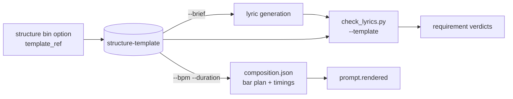

# Lyric templates: structure and rhyme as a contract

Writing a lyric is easier, and checkable, when the shape is chosen first. Two libraries hold that
shape as data:

- [`vocabulary/structure-templates.json`](../../vocabulary/structure-templates.json) — **15 song
  structures**, each an ordered list of sections with bar counts, line counts, a rhyme scheme and
  an energy level.
- [`vocabulary/rhyme-schemes.json`](../../vocabulary/rhyme-schemes.json) — **13 rhyme patterns**,
  from couplets to common metre to internal rhyme.

Plus the tooling that makes them load-bearing rather than decorative:

- [`vocabulary/structure_templates.py`](../../vocabulary/structure_templates.py) — prints a
  template either as a **writing brief** for the lyric generator or as a **timed bar plan** for
  the composer.
- [`vocabulary/check_lyrics.py`](../../vocabulary/check_lyrics.py) `--template=<id>` — verifies a
  finished lyric against the template it was written to.

## 1. A template is a contract, not a label

A dropdown that says "Verse-Chorus-Bridge" tells the generator nothing it can act on and gives the
checker nothing to verify. A template instead answers every question the lyric stage needs:

| Question | Template field |
| --- | --- |
| Which sections, in what order? | `sections[].role` |
| How long is each one musically? | `sections[].bars` |
| How many lyric lines? | `sections[].lines` |
| What rhyme pattern? | `sections[].rhyme_scheme` → an id in the rhyme library |
| How hard should it hit? | `sections[].energy` (1–5) |
| May it be left out? | `sections[].optional` |
| Where is the hook? | `sections[].hook` |

That is enough for three consumers to agree: the writer gets a brief, the composer gets a bar
plan, and the checker gets a specification. It is the same "one vocabulary, three consumers" idea
as the tag bins, applied to shape instead of sound.

## 2. As a writing brief

```bash
python3 vocabulary/structure_templates.py --template=rap_verse_hook --brief
```

```
WRITING BRIEF -- Rap verse and hook (rap_verse_hook)

  [Verse 1]
      8 lines | rhyme AABBCCDD (aabbccdd) | energy 3/5

  [Chorus]
      4 lines | rhyme AAAA (aaaa) | energy 4/5 | this is the hook
  ...
Rules
  - 6-10 syllables per line; keep lines in the same position across
    repeated sections within 2 syllables.
  - At most one modifier per tag, written [Section - modifier].
  - Uppercase inside a line means louder delivery; parentheses mean backing vocal.
  - Keep one core metaphor for the whole song rather than mixing images.
```

This is the brief handed to the lyric model, and it is deliberately explicit. It carries the
generator's own documented guidance — the syllable band, the one-modifier rule, the uppercase and
parenthesis semantics, the metaphor discipline — so that the rules arrive with the task rather
than as a separate set of instructions that can be forgotten.

### 2.1 A directive is not a lyric

The brief is explicit because the rules belong with the task, and the same explicitness is what
makes a model occasionally copy a line of it into the song. `energy 3/5` is the common one: it sits
among a section's details, and the model writes it as the verse's first line, where the meter check
counts it as a phrase and the renderer sings it.

Every directive is one of the brief's own line templates, so code recognises one exactly — a
whole-line match against the templates `print_brief` emits, never a judgement — and
`musicmaster.lyrics.strip_directives` removes it and reports what it removed. The generator runs the
repair on a finished draft, in the page and on the CLI alike, and the checker reports a directive
that survived as an error, because one still in the lyric was written or pasted by hand.

## 3. As a bar plan and a time budget

```bash
python3 vocabulary/structure_templates.py --template=pop_standard --bpm=95 --duration=180
```

```
   #  section                bars lines  rhyme energy   start    dur
   1  Intro (opt)               4     -      -      2    0:00  10.1s
   2  Verse 1                  10     4   aabb      2    0:10  25.3s
   3  Pre-Chorus                4     4   abab      3    0:35  10.1s
   4  Chorus                   10     4   aabb      4    0:45  25.3s
  ...
  total: 70 bars, 2:57 (176.8s)
  scaled to the requested duration; achieved 176.8s
```

Three design points are visible in that output:

1. **The arithmetic is in code.** Bars to seconds, sections to start times, and scaling a template
   to a requested duration all happen here. No language model is asked for a timestamp.
2. **Scaling is reported, not hidden.** `pop_standard` is naturally 60 bars; filling 180 s at
   95 BPM needs 70, so every section scaled by a factor and was rounded to an even bar count. The
   achieved duration is printed beside the target, because a plan that quietly misses by 20 s is
   the kind of thing that surfaces as "the song is too short" much later.
3. **Bar counts stay musical.** Sections round to even numbers and never drop below two bars, so
   scaling cannot produce a three-bar chorus.

### 3.1 The singable time

A three-minute song is not three minutes of words. The timeline separates them:

```bash
python3 vocabulary/structure_templates.py --template=pop_standard --timeline --bpm=95 --duration=180
```

```
  total 2:57 (176.8s)  |  vocal 2:37 (156.6s)  |  instrumental 0:20 (20.2s)  |  2 of 10 sections carry no vocal

   #  section                vocal bars lines  start     dur  singable   budget  ceiling density
   1  Intro (opt)               no    4     -   0:00   10.1s      0.0s        -        -       -
   2  Verse 1                  yes   10     4   0:10   25.3s     25.3s    24-40       81  1.58/s ~
   3  Pre-Chorus               yes    4     4   0:35   10.1s     10.1s    24-32       32  3.17/s
```

Intros, outros, interludes, solos, breakdowns and drops are instrumental by construction: the
section vocabulary marks them, and a section with no `lines` is instrumental regardless. So the
writer is told which sections take words — and, more usefully, which do **not**. An outro with
words in it is an error rather than a style choice, because there is no vocal there to sing them.

### 3.2 Budget and ceiling are different numbers

Two figures come out of the plan, and conflating them is the mistake this section exists to
prevent:

| | What it is | Where it comes from |
| --- | --- | --- |
| **Budget** | `lines x band` — what the writer is asked for | the delivery profile's syllables-per-line guidance |
| **Ceiling** | `singable seconds x syllables per second` | the clock, and how fast the delivery can go |

The budget is a writing target; the ceiling is physics. And the budget is **clipped by the
ceiling**, because stating a band the section cannot hold is advice that is wrong on its face: a
4-bar pre-chorus with 4 lines cannot carry 10 syllables a line at 95 BPM, so its budget reads
24–32 and the brief says *"at most 8 syllables per line here — the clock, not the band, is the
limit"*.

The band is delivery-dependent, which is why it lives in
[`delivery-rates.json`](../../vocabulary/delivery-rates.json) rather than being a constant. Rap
lines carry far more syllables than sung ones, so the profile is picked from the tag selections: a
caption containing "Male Rap Vocals" gets the rapped band (8–16 per line) and a 6.5 syllables/second
ceiling, where a ballad gets 5–9 and 2.6. The profile is a heuristic over option ids and is reported
beside every number it produced.

### 3.3 What scaling does to density

Filling an exact duration stretches every section, and that has a cost. `pop_standard` is naturally
60 bars; three minutes at 95 BPM needs 70, so each section stretched and rounded to an even bar
count — and five came out **sparse**, a 10-bar verse carrying 4 lines being 1.58 syllables/s against
a comfortable 2.3. The plan says so, and names the three ways out: accept a roomier delivery, raise
the tempo, or carry more lines.

That is the trade the timeline makes visible. Hitting a duration and keeping a density are different
goals, and a template stretched to a target usually loses the second one.

### 3.4 What it caught on the real fixture

Running the fixture's lyrics against `pop_standard` at 95 BPM:

```
    section                written    budget  ceiling     rate
    Verse 1                     46     32-64      131   2.28/s
    Chorus                      30     32-64      131   1.48/s
    Verse 2                     44     32-64      131   2.18/s
    Bridge                      44     32-64       66   4.35/s
    Outro                       36       0-0        0        -

ERROR: [Outro]: 36 syllables written into an instrumental section (10.1s); there is no vocal there
oracle: [Chorus]: 30 syllables under the 32-64 budget; the section will feel empty unless the arrangement carries it
```

Three things worth noting. The outro error is exactly the class of problem the user asked this to
catch: a lyric with a perfectly good four-line outro written for a form whose outro is
instrumental, so those words have nowhere to go. The delivery profile was auto-detected as
**Rapped** from the caption, which is why the verses fit comfortably at 2.28 syllables/s where a
sung profile would have flagged them. And the chorus is *under* budget rather than over — reported
as a note for the oracle, because an under-filled section is not a defect, it is a production
decision about whether the arrangement carries it.

## 4. As a conformance check

```bash
python3 vocabulary/check_lyrics.py lyrics.md --template=pop_standard
```

```
  template 'pop_standard': Pop standard
    sections matched : 5 of 10
    missing          : ['pre_chorus', 'pre_chorus', 'chorus', 'chorus']
    note             : optional section 'intro' is absent
```

Sections are aligned with an LCS rather than a greedy walk, so repeated sections line up and one
skipped optional section does not cascade into false mismatches for everything after it.

What is checked, and how hard:

| Check | Rigour |
| --- | --- |
| Section sequence | **Exact.** Missing expected sections are errors; unexpected ones are warnings |
| Lines per section | **Exact** against the template, reported as a warning |
| Hook present | Exact, when the template marks one |
| Rhyme scheme per section | **Advisory**, and only for `kind: end` schemes. A match ratio is reported, weighted by the scheme's own `strictness`. A `kind: internal` scheme skips the pattern comparison and asks instead whether interior rhyme is present; `kind: none` skips rhyme checking (see §5.1) |

The rhyme check is advisory because the detector is spelling-based, which the real fixture
demonstrated by missing some genuine rhymes and finding false pairs. Schemes
are therefore labelled `strict` (a mismatch is worth acting on) or `lenient` (a mismatch is as
likely to be the detector's fault). `internal` is the clearest case: internal rhyme is the
dominant technique in modern rap, the end-rhyme detector cannot see it at all, and a template
using it should expect a reported mismatch rather than trust one.

## 5. Phrasing: the line is not the unit

A written line is not what meets the music. Cadence splits lines in the middle, one line can hold
two phrases, and a phrase can straddle a line break. Counting syllables per printed line therefore
measures the wrong thing, and it produced a false positive on this project's own fixture: a
line-based count flagged ten verse lines as over-long, where the phrase-aware count flags two.

So the checker counts **phrases**, not lines:

- A phrase break is an explicit caesura marker — `/` or `|`, written but never sung — or, failing
  that, punctuation: comma, semicolon, colon or dash.
- The syllable band applies to the **phrase**, because the phrase is what has to fit a breath and a
  bar.
- The line is still reported, because a line is what a template specifies, and the line total is
  how a long unpunctuated line gets caught: a written line longer than twice the band's maximum is
  flagged whether or not it contains a break.

On the real fixture, `Open up the canvas, blank slate on my screen` is 11 syllables as a line and
**6/5** as phrases — both inside the band. The two lines that are genuinely long (11 and 13
syllables) are exactly the two with no internal punctuation.

**Syllables per bar** is the number the model actually meets, and it is *derived* rather than
counted: a template section's bars and lines give bars per line, and the section's syllable total
gives syllables per bar. `pop_standard`'s verse is 8 bars and 4 lines, so a 6–10 syllable line
spans two bars and the per-bar target is 3–5. A section above the comfortable maximum per bar is
flagged as crammed.

### 5.1 Sound devices a line-based model cannot see

End-rhyme schemes are one dimension of sound structure and the one that matters least to a skilled
writer. Two others are now counted separately, as observations rather than pass/fail:

- **Internal rhyme** — pairs of stressed words rhyming inside one line, with function words and
  identical words excluded (repetition is a device, but a different one). Rap carries verses on
  this rather than on end rhyme, which is why the `internal` rhyme scheme now *skips* end-scheme
  conformance and instead asks whether interior rhyme is present at all. Before `kind` existed, a
  template declaring internal rhyme was guaranteed to report a mismatch — the check was measuring
  the wrong thing.
- **Alliteration** — repeated onsets among stressed words. Reported as a count; the failure mode is
  over-density rather than under-density, because a line with four alliterative chains is a
  tongue-twister.

### 5.2 The limit, stated rather than hidden

Cross-line embedded rhyme — an interior word in one line reaching forward into another line's
ending, the signature move of a skilled lyricist — is **deliberately not reported**. Whether two
syllables rhyme depends on stress and vowel length, and spelling encodes neither:

| Pair | Looks like a rhyme | Actually |
| --- | --- | --- |
| `open` / `screen` | both key on `-en` | /ˈoʊpən/ vs /skriːn/ — no |
| `hit` / `right` | both key on `-it` | /hɪt/ vs /raɪt/ — no |
| `insane` / `chain` | both key on `-ane` / `-ain` | /ɪnˈseɪn/ vs /tʃeɪn/ — **yes** |

Fixing a silent-final-*e* bug in the key recovered the third row and removed a whole class of false
pairs — `insane`, `image` and `node` had all been keying on a bare `e` and matching each other — but
the first two rows show the ceiling. A pronunciation lexicon is the fix, and until it is a
dependency the checker prints that note instead of a number. A figure that is mostly an artifact is
worse than no figure, because it will be acted on.

## 6. How it wires into the pipeline



The `structure` bin in the tag vocabulary carries a `template_ref` on each option, so choosing a
form in the UI is what selects the contract — the link is validated in both directions, and the
validator warns when a template is unreachable from any control. Four templates are reachable
from more than one option (both "Chill Loop" and "Loop-Based" select `loop_based`), which is why
the check is a warning rather than an error.

## 7. The libraries

### Structures

| Template | Bars | Sections | Use |
| --- | ---: | ---: | --- |
| `pop_standard` | 60 | 10 | Default when a brief names no form |
| `verse_chorus` | 40 | 6 | Indie rock, folk, punk, short briefs |
| `verse_pre_chorus_chorus` | 48 | 8 | Pop, K-pop, anything needing a build |
| `hook_first` | 44 | 6 | Streaming-era pop, short-attention briefs |
| `aaba` | 32 | 4 | Jazz standards, show tunes |
| `twelve_bar_blues` | 52 | 5 | Blues, soul, gospel |
| `through_composed` | 72 | 6 | Progressive rock, art pop, narrative folk |
| `loop_based` | 48 | 7 | Lo-fi, chillhop, instrumental-forward |
| `build_drop` | 44 | 7 | EDM, house, dubstep |
| `storyteller` | 44 | 6 | Folk, country, protest song |
| `rap_verse_hook` | 72 | 7 | Hip-hop, trap, drill, grime |
| `ballad_dynamic` | 52 | 8 | Power ballad, soul, film soundtrack |
| `radio_short` | 36 | 5 | Radio edit, short-form video, hard durations |
| `call_response` | 40 | 6 | Gospel, soul, stadium chorus |
| `one_verse_sketch` | 12 | 2 | Idea capture, prototype |

### Rhyme schemes

| Scheme | Pattern | Kind | Use | Strictness |
| --- | --- | --- | --- | --- |
| `aabb` | AABB | end | Pop verses, hip-hop, hooks | strict |
| `abab` | ABAB | end | Ballads, country, forward motion | strict |
| `abcb` | ABCB | end | Folk ballads, narrative — the most forgiving useful scheme | lenient |
| `aaaa` | AAAA | end | Rap verses, chants, drill | strict |
| `abba` | ABBA | end | Poetic verse, bridges | strict |
| `aaab` | AAAB | end | 12-bar blues, soul, gospel | lenient |
| `aaba` | AABA | end | Jazz standards, show tunes | lenient |
| `abac` | ABAC | end | Spoken-word verses, dense imagery | lenient |
| `xaxa` | XAXA | end | Rap, conversational delivery | lenient |
| `aabbccdd` | AABBCCDD | end | Eight-line rap verses | strict |
| `chain` | ABAB CDCD | end | Long verses that must not settle | strict |
| `free` | XXXX | none | Ambient, spoken word — skips the check | lenient |
| `internal` | A(AA)A | internal | Rap, drill, grime — checked for presence, not pattern | lenient |

## 8. Extending

```bash
python3 vocabulary/validate_vocabulary.py
python3 vocabulary/structure_templates.py --list
```

The validator checks schema conformance, unique ids, that every section `role` is a real section
in the lyric metatag vocabulary, that every `rhyme_scheme` resolves, that a section with lines has
a scheme and vice versa, that a template with a chorus marks a hook, that the energy arc is not
flat on a form long enough to have one, and — the check that caught a real error while writing
this — that the bar plan and the claimed duration are physically compatible at a plausible tempo.
`through_composed` originally claimed 150–260 s on a 36-bar plan, which is only reachable at 33 BPM;
the check failed and the template was rewritten to 72 bars.

Deliberately *not* templated yet: chord progressions, melodic contour, and vocal register. Those
belong to the composition artifact rather than the lyric, and the honest reason they are absent is
that their enforcement would be `measured` rather than `verified` — they cannot be checked on text
alone.

## 9. Open questions

- **Should conformance be a hard gate?** Currently a missing section is an error and everything
  else is a warning. A brief that says "write me a pop song" probably should not fail because the
  writer chose an ABCB verse, but a brief that names a template probably should. The distinction
  is whether the template came from the user or from a default.
- **Is one template per song right?** All of these assume a single shape. Verse-only sections with
  a different internal scheme (a double verse, a tag) are common enough to need a modifier rather
  than a new template.
- **Rhyme strictness for rap.** The `internal` scheme is honest about being undetectable, but a
  `chain` scheme marked `strict` will still produce false warnings on legitimate slant rhyme. Both
  need the pronunciation lexicon before their strictness is trustworthy.
- **Bar counts versus a real arrangement.** Templates assume 4/4 and conventional 8-bar sections.
  A brief that asks for a 3/4 waltz or a 7-bar phrase has no template, and the validator's tempo
  envelope would need the real meter to check it.
