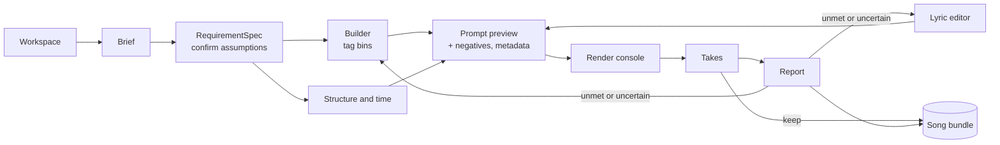

# Music Master — UI and front-end plan

Status: plan, not built. Companion to [`compliance-architecture.md`](compliance-architecture.md),
[`tag-vocabulary.md`](tag-vocabulary.md) and [`lyric-templates.md`](lyric-templates.md).

## 1. Are we ready?

**Yes for a v1 that covers brief → prompt → render → verify → listen.** The hard part is already
done, and it is not the part people expect: the *data model* is the UI. `vocabulary/tag-bins.json`
already declares, per bin, the `control` to draw, the `group` to place it in, `min`/`max_selections`,
`help`, `priority`, `caution`, `emits_tag`, `polarity` and `template_ref`. The original design note
said "adding an option to the file adds a checkbox; no UI code changes" — so a form generator is the
main component, not 32 hand-built forms.

What exists and can be driven today:

| Layer | State | Evidence |
| --- | --- | --- |
| Vocabulary (32 bins, 792 options) | complete, validated | `vocabulary/tag-bins.json`, `validate_vocabulary.py` |
| Lyric grammar (132 tags, 6 pools, 3 mechanisms) | complete, validated | `vocabulary/section-tags.json` |
| Structure templates, rhyme schemes, delivery profiles | 17 / 13 / 6 | `vocabulary/structure-templates.json` and siblings |
| Time budget | working | `vocabulary/timeline.py` |
| Tag rendering with budget and polarity | working | `vocabulary/render_tags.py` |
| Lyric checking (sections, phrases, rhyme, fit, tags, transitions, clichés) | working | `vocabulary/check_lyrics.py` |
| Prompt + workflow build, ComfyUI submit, takes | working | `songs/*/build_and_submit.py` |
| Measurement (mechanical, vocal character, transitions, dynamics) | working | `songs/*/analyse_*.py`, `verify_render.py` |
| Schemas | 9 written | `schemas/` |

What is missing, and what the UI must therefore show honestly rather than fake:

- **No oracle configured.** The whole semantic battery is designed and unrun, so caption/lyric
  consistency, theme adherence and hook payoff are `unverified`.
- **No captioner and no ASR.** Genre fidelity, production character, intelligibility and
  `sung == written lyric` have no evidence channel.
- **Transitions and per-section arrangement are not controllable** through lyric tags — measured
  twice, 1/9–2/9 met and 0/7–1/7 met. The UI must not render a control that does nothing.
- **The screening metrics are genre-dependent.** Harmonicity 0.25 is a failure on one song and
  correct on another. A bare score in a UI is a lie by omission.

## 2. What the UI is for

**Goals.**

1. Make the four artifacts (composition, lyrics, prompt, audio) editable and inspectable as a
   bundle, so the source/build distinction is visible rather than notional.
2. Put the constraints where the decisions are made: syllable budget next to the line, tag budget
   next to the tags, time budget next to the section.
3. Make the compliance report the primary output surface, not a footnote — including its
   `unverified` rows.
4. Make a take selectable by seed and reproducible on demand.
5. Keep the creative loop fast: nothing modal, nothing blocking, validation inline.

**Non-goals for v1.**

- Not a DAW. No audio editing, no mixing, no stem surgery.
- Not a model trainer. No LoRA or fine-tuning UI.
- Not multi-user. A single local workspace.
- Not a vocabulary editor in v1 (the file + validator workflow is good enough; see M5).
- Not a phone app.

## 3. Design principles

Each of these is a consequence of something measured or built, not a preference.

1. **The vocabulary is the form.** Controls are generated from `control`; groups from `group`;
   help from `help`; caps from `min`/`max_selections`. No hand-coded field lists anywhere.
2. **Four artifacts, four editors, one bundle.** The user always knows whether they are editing
   source (composition, lyrics, prompt) or looking at a build product (audio).
3. **`unverified` is never green.** Not checked is not passed. Colour, icon and wording must make
   the difference unmissable — this is the failure mode the entire project exists to avoid.
4. **Never conflate the two guarantees.** Intent fidelity (does the prompt encode the brief?) is
   cheap and text-native. Realization fidelity (does the audio realize the prompt?) is expensive
   and partly impossible. Separate panes, separate headings, separate counts.
5. **Show the budget always.** Every authoring control displays its cost live: tags used, syllables
   used, seconds used. A choice whose cost is invisible is a choice made blind.
6. **Do not offer controls that do not work.** Transition tags are declared and verified but rarely
   honoured by the model; a disabled checkbox with a reason beats an enabled one that lies.
7. **A metric needs an expected direction.** Never show a bare score. Show it against what the spec
   asked for, derived from the template's vocal tags and the `avoid` bin.
8. **Artifacts are content-addressed, not ordinal.** Address takes by seed, prompts by hash. The
   `take1.mp3` collision that overwrote a batch is why.
9. **Reproducibility is a button.** "Re-render exactly this" from the recorded prompt hash, seed,
   vocabulary version and sampler settings.
10. **The report is evidence, not a score.** For every verdict, show what was measured, what was
    asked, and which checker decided.
11. **Keyboard-first.** This is a text-heavy creative tool; the mouse is for audio.

## 4. Information architecture



Eleven surfaces, of which four carry the weight: **Builder**, **Lyric editor**, **Takes**, **Report**.

| # | Surface | Purpose | Milestone |
| --- | --- | --- | --- |
| 1 | Workspace | songs, statuses, new song | M1 |
| 2 | Brief & spec | brief in, typed requirements out, confirm assumptions | M2 |
| 3 | Builder | the generated bin form, live caption | M2 |
| 4 | Structure & time | template, tempo, duration, timeline, transitions | M2 |
| 5 | Lyric editor | text + grammar lens + per-section inspector | M3 |
| 6 | Prompt | canonical prompt, negatives, metadata, target, diff, hash | M3 |
| 7 | Render console | preflight, queue, progress, retry | M4 |
| 8 | Takes | seed-addressed grid, waveform by section, A/B, keep | M4 |
| 9 | Report | intent vs realization, per-requirement evidence, unverified | M1 (read-only) → M5 (live) |
| 10 | Vocabulary | browse, validate, extend | M6 |
| 11 | Settings | oracle, key, target, paths, egress statement | M4 |

## 5. The core/UI seam

The single biggest architectural risk is reimplementing the checks in the UI. Everything the
interface shows already exists as a script; the UI must call it, not copy it.

**Extract the scripts into one package** (`musicmaster/`), with the current files becoming modules
with the same logic and no duplicated rules:

```
musicmaster/
  vocabulary.py   # load, validate, options, polarity, label maps
  timeline.py     # build_timeline, check_fit, rates  (from vocabulary/timeline.py)
  lyrics.py       # parse, check, template conformance       (from check_lyrics.py)
  render.py       # render tags, budget, negatives            (from render_tags.py)
  prompt.py       # canonical prompt, target rendering, hashing
  generate.py     # Generator protocol, ComfyUI adapter       (from build_and_submit.py)
  measure.py      # mechanical, vocals, transitions, dynamics (from analyse_*.py)
  oracle.py       # Jev / local / replay
  bundle.py       # song directory, manifest, manifest hashes
  api.py          # the typed surface the UI is allowed to use
  cli.py          # musicmaster brief|compose|lyrics|prompt|render|verify
```

Then a thin local server exposes `api.py` over HTTP/JSON plus server-sent events for progress. The
CLI and the UI are two clients of one core, which is also what makes the UI testable without a
browser.

The API the UI needs, at minimum:

```
GET  /api/songs                          -> [{id, status, caption, updated}]
POST /api/songs                          -> create from a brief
GET  /api/songs/:id/bundle               -> artifacts + hashes + manifest
GET  /api/songs/:id/spec                 -> RequirementSpec + assumptions pending
POST /api/songs/:id/spec/confirm         -> confirm inferred requirements
GET  /api/vocabulary                     -> bins, options, groups, controls, cautions
GET  /api/templates                      -> templates + rhyme schemes + profiles
POST /api/songs/:id/render               -> {caption, prompt}      -> prompt + tag budget + coherence
GET  /api/songs/:id/timeline?bpm&duration-> rows + totals + budgets
POST /api/songs/:id/lyrics/check         -> findings, per-section inspector data
POST /api/songs/:id/lyrics/brief         -> the writing brief for this template
GET  /api/songs/:id/prompt               -> canonical prompt, hash, target rendering
POST /api/songs/:id/render               -> queue takes; SSE /api/jobs/:id for progress
GET  /api/songs/:id/takes                -> seed-addressed takes + screening metrics
POST /api/songs/:id/takes/:seed/keep     -> promote a take
GET  /api/songs/:id/report               -> per-requirement verdicts + evidence + unverified
GET  /api/capabilities                   -> target capabilities (for gating controls)
```

Capability gating matters: `GET /api/capabilities` is how the builder knows to disable `5/4` and
`7/8` with a reason, and how a future model swap changes the form without a code change.

## 6. The four surfaces that matter

### 6.1 Builder

```
┌ Music Master ─── rap-metal-groove ───────── target: ACE-Step 1.5 XL turbo ──────── [Render ▸] ┐
│ ┌ Style ──────────────────┐ ┌ Rhythm ─────────────────┐ ┌ Live caption ─────────────────────┐ │
│ │ Genre     [Rap Metal ▾] │ │ Tempo   92 ──●───── BPM │ │ Rap Metal, Hip-Hop, Funk, Punk,   │ │
│ │ Fusion    ☑ Hip-Hop     │ │ Time sig [4/4     ▾] ⛔ │ │ Syncopated, Breakbeat, Groovy,    │ │
│ │           ☑ Funk        │ │ Key      [E ▾][minor▾]  │ │ Offbeat, Live Drums, Punchy Kick, │ │
│ │           ☑ Punk        │ │ Tuning   [Drop D  ▾]    │ │ Fingerstyle Bass, Distorted Bass, │ │
│ ├ Groove ─────────────────┤ ├ Vocals ────────────────┤ │ Distorted Guitar, Downtuned …     │ │
│ │ ☑ Syncopated ☑ Breakbeat│ │ Lead ☑ Male Rap Vocals  │ │                                   │ │
│ │ ☑ Groovy     ☑ Offbeat  │ │      ☑ Spoken Word      │ │ tags 32 / 32    omitted 5 ⓘ       │ │
│ └─────────────────────────┘ └─────────────────────────┘ │ [Copy] [Diff] [Save]              │ │
│                                                          └───────────────────────────────────┘ │
│ ⚠ 1 caution (5/4 unreliable)   ⛔ 2 unavailable on this target   ⚠ 1 coherence note            │
└──────────────────────────────────────────────────────────────────────────────────────────────┘
```

- Groups are collapsible and remember their state; the group order comes from the data.
- The budget meter is always visible; over-budget tags show what will be dropped, by priority.
- `caution` renders as a warning chip on the option, not a tooltip nobody reads.
- Capability-unavailable options are disabled with the reason inline (`⛔ unreliable on this model`).
- The `avoid` bin is a separate panel labelled **Must not appear**, visually distinct because it
  subtracts rather than adds.

### 6.2 Lyric editor

The hardest surface, and the one with a real design decision: **the lyric is the user's text, and it
must stay a text file.** Structured editing that cannot round-trip is a trap. So: a text editor with
a grammar lens, plus an inspector that reads it.

```
┌ Lyrics ── rap-metal-groove ────────────── [copy writing brief] [check ✓ clean] ────────────────┐
│ ┌ text ───────────────────────────────┐ ┌ section inspector ────────────────────────────────┐ │
│ │ [Verse 1]                           │ │ [Verse 1]    16 bars · 41.7s · 8 lines            │ │
│ │ [rap]                               │ │  syllables   115 / 64–128     ceiling 271  2.8/s  │ │
│ │ [spoken word]                       │ │  phrases     ▇▇▇▇▇▇▇▇▇▇ all inside 8–16            │ │
│ │ [driving]                           │ │  rhyme       internal · 2 interior pairs ✓        │ │
│ │ [aggressive]                        │ │  tags        rap ✓ spoken word ✓ driving ✓        │ │
│ │ They sold you the future, then…     │ │  exit        [build-up] ✓                         │ │
│ │ …                                   │ │  notes       ⚠ line 16 crowded — add a caesura /  │ │
│ │ [build-up]                          │ └───────────────────────────────────────────────────┘ │
│ └─────────────────────────────────────┘                                                       │
│ ┌ timeline ─────────────────────────────────────────────────────────────────────────────────┐  │
│ │ 0:00 ▏Intro 0:10 ▏Verse 1 0:52 ▏Chorus 1:13 ▏Verse 2 1:55 ▏Chorus 2:35 ▏Solo 2:56 ▏Chorus │  │
│ │      ░░░░░      ▓▓▓▓▓▓▓▓▓▓      ███████      ▓▓▓▓▓▓▓▓▓▓      ███████      ▒▒▒▒▒▒      ██████│  │
│ └───────────────────────────────────────────────────────────────────────────────────────────┘  │
└───────────────────────────────────────────────────────────────────────────────────────────────┘
```

Behaviour:

- Tag autocomplete from the six pools, filtered by what the current slot allows (a modifier is only
  offered after a section header; a transition is only offered near the end of a section).
- Unknown or mis-stacked tags get squiggles, not a modal, with the fix in the tooltip.
- Caecura markers (`/`, `|`) render as a visible thin break so phrase segmentation is legible.
- The inspector is per-section and updates on the caret, not on save.
- Clicking a finding ("add a caesura") inserts the marker at the right place. Findings are
  actionable, not just reported.
- The "copy writing brief" button emits exactly what `structure_templates.py --brief` prints, so a
  user can take the same brief to an external model and paste the result back.

### 6.3 Takes

```
┌ Takes ── rap-metal-groove ──────────────────────────── [render 3 more] [render exactly seed 4409]┐
│ ┌ seed 4409 ────────────────────────────────┐ ┌ seed 12328 ───────────────────────────────┐   │
│ │ ▁▂▅▇▅▂▁▂▅▇▅▂▁▂▅▇▅▂▁▂▅▇▅▂  ▶ 3:08          │ │ ▁▂▅▇▅▂▁▂▅▇▅▂▁▂▅▇▅▂▁▂▅▇▅▂  ▶ 3:08         │   │
│ │ ▏Intro▏Verse▏Chorus▏Verse▏Chorus▏Solo…    │ │ ▏Intro▏Verse▏Chorus▏Verse▏Chorus▏Solo…   │   │
│ │ harmonicity 0.25 ─ expected LOW ✓         │ │ harmonicity 0.34 ─ expected LOW ✓        │   │
│ │ transitions 1/7 · dynamics flat           │ │ transitions 1/7 · dynamics flat          │   │
│ │ [keep] [discard] [details]                │ │ [keep] [discard] [details]               │   │
│ └───────────────────────────────────────────┘ └──────────────────────────────────────────┘   │
└───────────────────────────────────────────────────────────────────────────────────────────────┘
```

Every metric carries its **expected direction**, derived from the spec — that is the difference
between this pane and a dashboard. "harmonicity 0.25 ✓ expected LOW" is information; "0.25" alone is
noise a user will misread.

### 6.4 Report

```
┌ Compliance ── rap-metal-groove / seed 4409 ───────────────── overall: 4 met, 1 unmet ──────────┐
│ INTENT FIDELITY      checked on the text, before rendering                        12 / 12 met  │
│ REALIZATION FIDELITY measured on the audio                                          4 / 5 met  │
│                                                                                               │
│ requirement   asked            measured                verdict   decided by                    │
│ duration      187.8s ± 2       187.8s                  met       code · audio.dsp.duration     │
│ tempo         92 BPM ± 6       184.57  (2× octave)     met       code · audio.dsp.tempo        │
│ key           E minor          E major   (corr 0.647)  UNMET     code · audio.dsp.key          │
│ clipping      ≤ 100 ppm        56.7 ppm                met       code · audio.dsp.peak         │
│                                                                                               │
│ UNVERIFIED — nothing checked these. Not passed, not failed.                                   │
│   genre fidelity · production character · vocal intelligibility · sung == written lyric       │
│   needs: a music captioner and an independent ASR                                             │
│                                                                                               │
│ DEFERRED — no oracle configured                                                               │
│   caption/lyric consistency · theme adherence · hook payoff                                   │
└───────────────────────────────────────────────────────────────────────────────────────────────┘
```

The pane that makes this project worth building is the `UNVERIFIED` block, and it must be visually
louder than the green ticks. A compliance report that quietly omits what it could not check is
exactly the artefact this design was written to prevent.

## 7. Data and persistence

No database. **The song directory is the record**, which is already true on disk and is the design's
whole point:

```
songs/rap-metal-groove/
  brief.md  song.json  selections.json  lyrics.md      <- source, hand-edited
  composition.json  prompt.json  workflow.json         <- generated, regenerable
  RESULT.md                                            <- hand-written write-up
  build_and_submit.py  verify_render.py  analyse_*.py  <- tooling
```

The UI writes only the source files plus the manifest. Generated artifacts are rebuilt. The manifest
records hashes, seeds, vocabulary version and environment, so the workspace listing can show "stale"
when a source artifact changed after the last render — which is the UI's most valuable piece of
bookkeeping and costs nothing because the hashes already exist.

Git is the versioning system. The UI does not invent one; it offers "show diff" and "revert file".

## 8. Long-running work

Renders take ~60 s each on the 3090 and the GPU is shared with other work, so:

- Submission is asynchronous and the UI never blocks. Progress over SSE.
- A preflight before queueing: is the service up, which models are loaded, how much VRAM is free.
- Failure is a first-class state: a rejected workflow shows ComfyUI's own error text, not "failed".
- A queue view with cancel. Batch renders are N sequential submissions, not one batch, because peak
  VRAM and per-take reproducibility both matter (already the behaviour in `build_and_submit.py`).

## 9. Honesty in affordances

Three specific places where the UI must resist a nicer-looking lie:

| Temptation | Instead |
| --- | --- |
| A green tick per requirement | `unverified` gets its own colour, its own heading, and a stated reason |
| A quality number for the take | the number plus its expected direction, plus "advisory" where the detector is approximate |
| An enabled transition control | enabled, but marked **declared — usually not honoured by this model** and always verified |

## 10. Tech stack

**Recommended: local web app.** FastAPI serving the core API + SSE, and a Svelte or React front end;
`wavesurfer.js` for the waveform. Reasons: audio in the browser is solved, the dense generated form
is easier in a component framework than in a desktop toolkit, and Python is already the core.

Rejected: Gradio/Streamlit (fast for a demo, cannot express the inspector-and-editor layout or the
audition grid); Electron/Tauri (no benefit over a local page, more packaging); a native toolkit
(would duplicate the audio and layout work for nothing).

It runs as its own local service on a dedicated port (e.g. `127.0.0.1:8787`), started as a managed
background job, and is entirely separate from the DSH Web GUI on 3080.

## 11. Phasing

| Milestone | Content | Done when |
| --- | --- | --- |
| **M0** | Extract `musicmaster/` package + CLI; current scripts become thin wrappers | the two existing songs build, check and report **byte-identically** through the package, and one test asserts it |
| **M1** | Read-only workspace + report viewer | opening either existing song shows its artifacts and verdicts, with `unverified` correct |
| **M2** | Brief → spec → builder → structure/time | a new song can be authored to a valid prompt without touching a file |
| **M3** | Lyric editor with grammar lens and inspector | the rap-metal lyric can be written in the UI, and every finding the CLI produces is reproduced |
| **M4** | Render console, takes, audition, settings, oracle wiring | render 3 takes, compare, keep one, see the report |
| **M5** | Live compliance battery (oracle + captioner + ASR) | `unverified` rows start disappearing, and the count is shown |
| **M6** | Vocabulary browser/editor, presets, prompt import | a new option can be added from the UI and validated |

M0 is the critical one and it is invisible. Building UI first would guarantee two implementations of
the same checks, and the second one would drift.

## 12. Open questions

1. **Where does the metric expectation come from?** Derivable for vocal character from the template's
   `vocals` plus the `avoid` bin, but transition and dynamics expectations are ad hoc. Needs a small
   declared-expectation field on the requirement, or a per-song expectations block.
2. **How structured is the lyric editor?** Text-with-lens is the recommendation because it round-trips,
   but section reordering and line-count enforcement are much nicer structurally. Worth a spike.
3. **Do we build the captioner and ASR before the UI?** The recommendation is no — ship the UI with
   `unverified` correct, because that state is the product's integrity and it should be visible from
   day one.
4. **One song at a time or a project?** The bundle is per-song; a project would group songs sharing a
   vocabulary version and a brief.
5. **Does the vocabulary admin belong in the app?** The file-plus-validator loop is good and the
   validator catches things a form would not. A read-only browser may be the whole answer.
6. **How much audition UI?** Waveform, section markers, A/B and blind comparison is real work; a track
   list with an audio element is an afternoon. Start small.
7. **Where does the UI live if the core moves to a box with the GPU?** The API boundary makes a remote
   core possible, but file-path assumptions in the current scripts do not.

## 13. Risks

| Risk | Why it matters | Mitigation |
| --- | --- | --- |
| Two implementations of the checks | the UI's green tick and the CLI's verdict diverge | M0 first; the UI has no validation logic of its own |
| The builder is a 792-option wall | users bounce off a form that looks like a spreadsheet | presets, search, progressive disclosure by group, and defaults from the brief |
| Green ticks creep in | the exact failure the project exists to prevent | `unverified` styling is a review gate, and the count is asserted in tests |
| ComfyUI is shared and external | renders fail or stall while the UI looks broken | preflight, explicit queue states, ComfyUI's own errors surfaced verbatim |
| Scope | eleven surfaces is a large v1 | milestones, and M1 is genuinely useful alone |
| Metric theatre | a dashboard of numbers nobody can act on | every metric shows its expected direction and its detector's reliability |

## 14. First commit of the next session

1. `musicmaster/` package skeleton with `vocabulary.py`, `timeline.py`, `render.py` extracted verbatim.
2. A parity test that runs both the old scripts and the new package on both songs and asserts
   identical output.
3. `api.py` with five endpoints: vocabulary, templates, timeline, caption-render, lyrics-check.
4. Nothing else. The UI starts once the core has one entry point.
